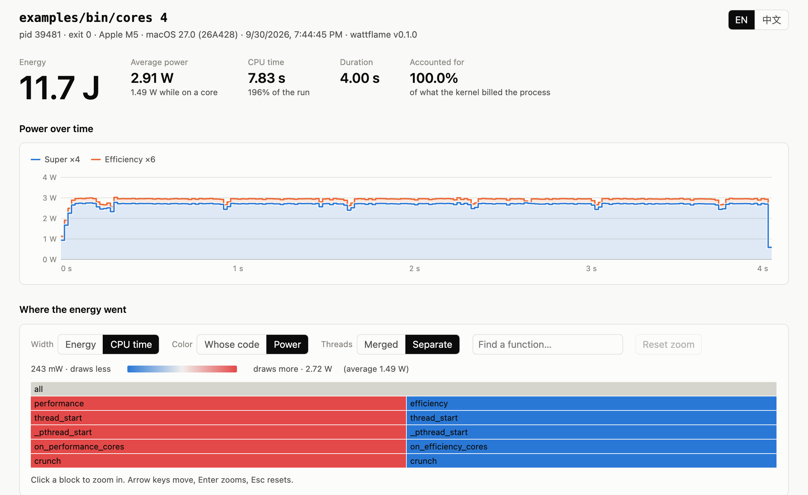
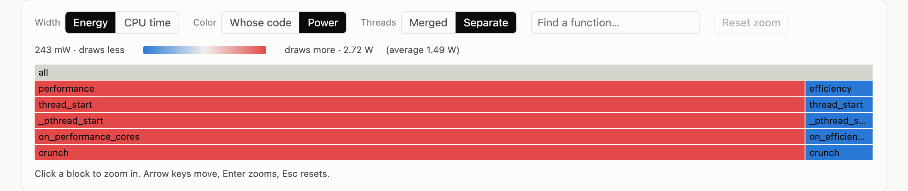
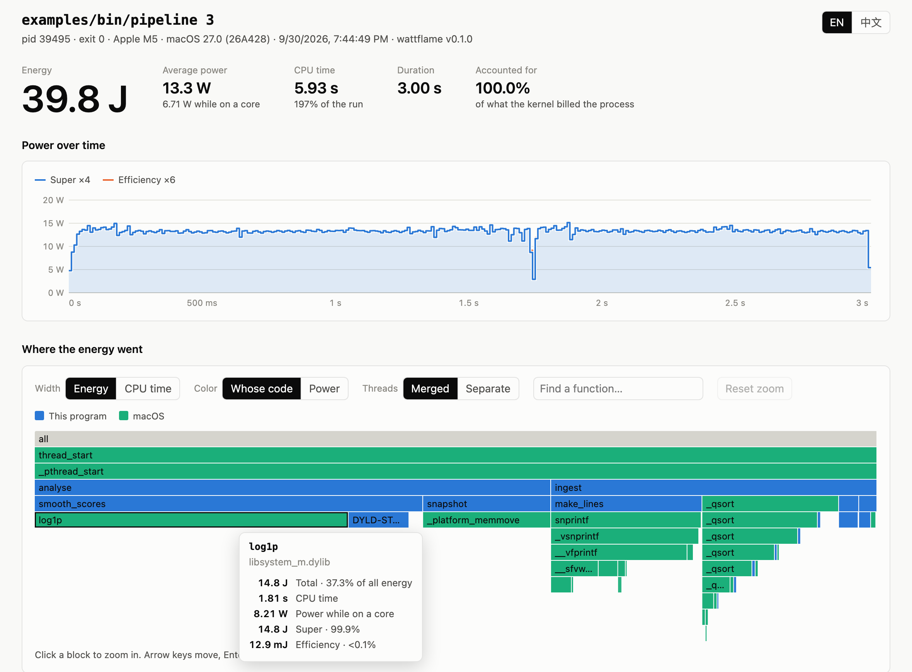

# wattflame

macOS（Apple Silicon）上的能耗剖析器。它告訴你一支程式的 CPU 電力被哪些函式用掉，並畫成一張「寬度代表焦耳」的火焰圖。

[English](README.md)



上圖是 `cores` 範例：兩個執行緒各自執行同一個函式四秒，一個跑在效能核心，一個跑在節能核心。圖的寬度是 CPU 時間，所以左右兩半一樣寬，這也是時間剖析器唯一能告訴你的事。但用功率上色之後，一邊是 2.7 W，另一邊是 0.24 W。把寬度改成能量，比例就變成 92% 比 8%：



Apple Silicon 有兩種核心，而且時脈一直在變，所以「花多少時間」和「耗多少電」已經不是同一個問題。wattflame 回答的是後者，可以細到函式和原始碼行號，適用於任何原生程式，不需要修改或重新編譯，也不需要 root 權限。

## 快速開始

需要 macOS 13 以上的 Apple Silicon Mac、Go 1.26 以上，以及 Xcode 命令列工具。

```console
$ git clone https://github.com/useless-husband/wattflame && cd wattflame
$ make build examples
$ ./wattflame record -- examples/bin/pipeline 3

  examples/bin/pipeline 3
  pid 27279 · exit 0 · Apple M5

  Energy     41.8 J   13.9 W average over 3.01 s
  CPU time   5.94 s   7.05 W while on a core
  Cores      Super 41.8 J (99.98%) · Efficiency 9.53 mJ (<0.1%)
  Accounted  100.0% of what the kernel billed to the process
  Profiler   250 mJ of its own (0.6% on top), 1000 Hz, 8.73 µs pause per stack

      SELF         TOTAL   POWER  FUNCTION
    15.3 J  36.5%  36.5%  8.54 W  log1p  libsystem_m.dylib
    7.21 J  17.2%  17.2%  7.98 W  _platform_memmove  libsystem_platform.dylib
    5.16 J  12.3%  16.2%  5.38 W  _qsort  libsystem_c.dylib
    3.24 J   7.7%   7.7%  8.82 W  DYLD-STUB$$log1p  pipeline
    2.87 J   6.8%  16.5%  5.77 W  __vfprintf  libsystem_c.dylib
    ...

  profile      wattflame.json
  flame graph  wattflame.html
```

用瀏覽器打開 `wattflame.html`（或加上 `--open` 自動打開）。它是單一檔案，沒有外部相依，也不會連網。



摘要各行的意思：

- **Energy**：這次執行總共用了多少能量，以及平均功率。
- **CPU time**：實際佔用核心的時間，以及佔用核心期間的平均功率。
- **Cores**：能量在效能核心與節能核心之間的分配。
- **Accounted**：這份紀錄的總能量，佔系統核心對同一批行程記帳總量的比例。
- **Profiler**：剖析器自己用掉的能量（不計入結果）。
- 表格的 **SELF** 是函式本身、**TOTAL** 包含它呼叫的函式、**POWER** 是它在核心上執行時的平均功率。

## 指令

| 指令 | 作用 |
|---|---|
| `wattflame record -- <指令> [參數]` | 執行一支程式並剖析它，連同它啟動的所有子行程。 |
| `wattflame record -p <pid> -d 10s` | 剖析一支已經在執行的程式。需要 `sudo`。 |
| `wattflame report <profile.json>` | 重新印出摘要；`-html out.html` 重新產生網頁；`-folded out.txt` 匯出 folded stacks，可給 speedscope、inferno、`flamegraph.pl` 使用（`-metric energy\|cpu\|samples`）。 |
| `wattflame diff <before.json> <after.json>` | 比較兩次紀錄：總量，以及能量變化最大的函式。 |

`record` 的旗標：`-o` 紀錄檔路徑、`-hz` 取樣頻率（預設 1000）、`-d` 錄多久就停、`-depth` 最大堆疊深度、`-top` 摘要列數、`-open`、`-no-html`、`-q`。`record` 的結束碼就是被執行程式的結束碼。

網頁上有四個控制項：寬度用能量或 CPU 時間；顏色用「程式碼來源」（這支程式、其他函式庫、macOS）或「相對於平均的功率」；執行緒與同名行程要合併或分開；以及搜尋框。點方塊可以放大，Esc 還原。下方表格列出每個函式的自身能量、合計能量、CPU 時間和功率；如果執行檔帶有除錯資訊，提示框會顯示最耗電的原始碼行。介面有英文和繁體中文。

## 運作原理

1. **能量來自系統核心，以執行緒為單位。** macOS 13 起，核心會替每個執行緒累計它在核心上執行時消耗的能量（奈焦耳），並依核心種類分開記錄。自己的行程可以用 `proc_pidinfo(PROC_PIDTHREADCOUNTS)` 讀到。這是晶片實際量到的數字，wattflame 沒有用模型估算。
2. **堆疊從行程外部取得。** 用 `DYLD_INSERT_LIBRARIES` 注入一個很小的函式庫，它在 `main()` 之前把程式的 Mach task port 交給 wattflame，之後不再做任何事。有了這個 port，取樣執行緒就能把每個可執行的執行緒暫停幾微秒、讀出暫存器、沿著 frame pointer 走一遍堆疊，再讓它繼續。符號由 CoreSymbolication 解析，也就是 Apple 的 `sample` 和 `atos` 背後的框架。
3. **每個堆疊分到「從上一個堆疊到現在」用掉的能量。** 核心會在執行緒離開核心時更新它的能量總數。為了讀堆疊而暫停執行緒，正好會讓它離開核心，所以每次取樣都附帶一個最新的讀數，和上一次讀數的差就記在這個堆疊上。以預設頻率來說，每個執行中的執行緒每毫秒讀一次。
4. **兩次取樣之間發生的事另外處理。** 執行緒如果在取樣後不久就停下來，最後那一小段的能量算在它最後被看到的堆疊上。如果整段工作都落在兩次取樣之間，能量會先保留，等某次取樣剛好碰到它在工作時再算給那個堆疊；碰到的機率和每段工作的長度成正比。執行緒結束時，它最後一小段的能量已經無法從自己的計數器讀到，但仍然在核心對整個行程的總數裡；這個差額會補給它最後一次被看到在執行的堆疊。
5. **無法取樣的行程仍然會被計入。** macOS 系統程式（包含編譯器和連結器）、加固過的 App、透過 Rosetta 執行的 Intel 程式不會交出 task port。wattflame 會巡覽行程樹找到它們，並從同一組計數器讀取能量（這不需要 task port）。它們在圖上顯示為 `[no stacks]`。任何行程在系統載入它、自己的程式碼還沒開始執行之前用掉的能量，則標示為 `[process startup]`。

細節請看 [docs/DESIGN.md](docs/DESIGN.md)：葉函式如何用 link register 找回呼叫者、`fork` 與 `exec` 時如何避免重複計算，以及注入的函式庫為什麼必須編譯成三種架構。給初學者的白話說明在 [docs/導讀.zh-TW.md](docs/導讀.zh-TW.md)。

## 量得準不準？

`examples/validate` 依序執行四個階段，並在每個階段前後向核心查詢整個行程的能量，這是不經取樣得到的標準答案。`make -C examples validate` 會用 wattflame 錄下這支程式，再比較它分配給各階段函式的能量：

```console
$ make -C examples validate
PHASE                    KERNEL    WATTFLAME DIFFERENCE
phase_float           6571.8 mJ    6571.8 mJ     -0.0%
phase_integer         3549.4 mJ    3549.4 mJ     +0.0%
phase_background       261.5 mJ     261.5 mJ     +0.0%
phase_bursty            19.2 mJ      19.2 mJ     -0.0%
all phases           10402.0 mJ   10402.0 mJ     +0.0%
```

重複執行多次，三個長階段的差距都在 0.1% 以內，短暫工作的那個階段在 1% 以內。

每次紀錄本身也會印出兩項檢查：

- `Accounted`：這份紀錄的總能量，佔核心記在被追蹤行程名下總量的比例，應該是 100%。如果有執行緒在兩次讀數之間結束，它也會說明其中多少是逐一讀取執行緒得到的、多少是從行程總量補回來的。
- `Seen`：當紀錄裡的 CPU 時間明顯少於核心回報的「這個指令和它所有子行程」的 CPU 時間時才會出現，代表有子行程太短命來不及被發現，或是以其他使用者身分執行。

測試也在壓力情境下檢查同一件事：100 個各只活 4 毫秒的執行緒、150 組 `fork` 後 `exec`、300 個一啟動就結束的行程。每一次都會拿紀錄和核心自己的總量比對。

上面的數字也說明了為什麼值得量：`phase_integer` 和 `phase_background` 執行同一個迴圈、同樣 1.5 秒，在節能核心上只要 262 mJ，在效能核心上要 3549 mJ。

## 額外負擔

在 Apple M5（4 個效能核心＋6 個節能核心）、macOS 27.0 上量測；量測時機器上同時有其他工作在跑，數字僅供參考。

| 工作 | 剖析器自身能量 | 每次取堆疊的暫停時間 |
|---|---|---|
| `examples/bin/pipeline 3`（2 個忙碌執行緒，13 W） | 程式的 0.6% | 10 µs |
| `examples/bin/cores 4`（2 個忙碌執行緒，2.8 W） | 程式的 2.8% | 14 µs |
| 冷快取下 `go build` 這個專案（555 個行程） | 整個編譯的 1.5% | 75 µs |

編譯的總時間（不用和使用 wattflame 交替執行）：2.42、2.89、2.68 秒，對上 3.20、3.61、2.78 秒。差距主要來自每個行程的固定成本：每個新行程都要交握一次、建立一份符號表。這次編譯的摘要顯示 `Accounted 100.3% ... (97.9% read thread by thread)` 和 `Seen 96.8%`。

剖析器自己的能量用和目標相同的方法量測（讀取樣執行緒的計數器），每次紀錄都會印出來，而且不計入結果。

## 哪些程式可以剖析

| 程式 | 結果 |
|---|---|
| 自己編譯的原生執行檔（已測試 C、C++、Swift、Rust、Go） | 完整堆疊、可讀的函式名稱；有除錯資訊時還有原始碼行號 |
| Homebrew 編譯的工具和直譯器 | 原生程式碼的完整堆疊 |
| Node.js 等 JIT 執行環境 | 原生部分可解析；JIT 產生的程式碼顯示為 `[unknown]` |
| 子行程、`fork`、`exec` | 自動跟隨 |
| macOS 系統程式、Apple 的編譯器與連結器、加固或公證過的 App（包含 python.org 的 Python）、Rosetta 下的 Intel 程式 | 有每個行程與執行緒的能量，沒有堆疊（`[no stacks]`） |
| 以其他使用者身分執行的子行程（setuid 程式） | 不計入；核心不允許讀取它們的計數器 |

## 限制

- **只量 CPU 能量。** GPU、記憶體、螢幕、儲存裝置、無線網路都不包含，因為核心沒有把這些歸到執行緒上。
- **解析度等於取樣間隔。** 能量是每次取樣時讀一次，所以交替得比取樣還快（預設 1 毫秒）的程式碼，會依被取樣到的比例分攤每次讀數。`-hz` 可以提高頻率，代價是暫停次數變多。
- **非常短命又無法自己報到的行程**（存活不到約 10 毫秒的系統程式）是靠定時巡覽找到的，大多會漏掉。`Seen` 那一行會顯示漏掉多少。
- **如果 wattflame 自己被 SIGKILL 強制結束**，而當下剛好有執行緒被它暫停（每個執行中的執行緒每毫秒約有 10 微秒處於這種狀態），那個執行緒會一直停著，只能把程式也結束掉。Ctrl-C、SIGTERM、SIGHUP、SIGQUIT 都有處理，不會留下任何東西。
- **需要 frame pointer** 才取得到堆疊。arm64 macOS 預設就有；用 `-fomit-frame-pointer` 編譯的程式碼堆疊會被截斷。
- **不支援 JIT 符號**、不取核心堆疊；被內聯的函式會算在呼叫者頭上。
- **附加模式（`-p`）我沒有測試過**：它需要 root，而開發過程中我沒有 root 權限。測試涵蓋的是啟動模式。
- 每個執行緒的能量介面（`PROC_PIDTHREADCOUNTS`）和 CoreSymbolication 都是私有 API。兩者自 macOS 13 以來都很穩定，載入時也做了防護，但 Apple 隨時可以更動。
- **虛擬機沒有執行緒能量計數器**（GitHub 的 macOS 雲端執行環境就是一例）。這時 wattflame 會改成記錄一般的 CPU 時間剖析，並且明確告知；測試在這種環境下會跳過能量相關的檢查。

## 相關專案

就我所知（2026 年 9 月），還沒有其他工具能對 macOS 上任意原生行程產生「以函式為單位」的能耗剖析。我找到最接近的有：

- [samply](https://github.com/mstange/samply) 搭配 [Firefox Profiler](https://profiler.firefox.com) 是這個平台上最好的時間剖析器，wattflame 注入函式庫交握的做法就是學它的。Firefox Profiler 能為 Firefox 自己顯示一條功率曲線（每個行程一條，畫在取樣旁邊）；它的呼叫樹是用取樣數、時間或位元組加權，不是能量，而 samply 在 macOS 上不記錄功率。
- Apple 的 Instruments 有給 iPhone、iPad App 用的 Power Profiler，回報各子系統的耗電影響，要自己和 CPU 剖析結果對照。`powermetrics`、[asitop](https://github.com/tlkh/asitop)、[macpow](https://github.com/k06a/macpow) 回報的是整台機器或每個行程的功率。
- [zeus-apple-silicon](https://github.com/ml-energy/zeus-apple-silicon) 量測你手動標記的程式碼區段。[CodeGreen](https://github.com/SMART-Dal/codegreen) 透過改寫原始碼把能量歸到函式。[JoularJX](https://github.com/joular/joularjx) 對 JVM 方法做同樣的事。
- [PowerMetricsKit](https://github.com/Androp0v/PowerMetricsKit) 從 App 內部讀取同一組執行緒計數器，但沒有堆疊。
- 用能量加權的剖析並不是新想法：PowerScope（Flinn 與 Satyanarayanan，1999）把堆疊取樣和三用電表的讀數對起來，eprof（Pathak 等人，2012）則針對手機 App。這裡新的地方是核心現在直接提供精確的執行緒能量，所以不需要外接儀器，也不需要功率模型。

## 建置與測試

```console
$ make build      # 先編譯注入用的函式庫，再編譯 wattflame
$ make test       # 單元測試與整合測試
$ make race       # 同上，開啟 race detector
$ make lint       # gofmt、go vet、staticcheck
$ make bench      # 驗證準確度，並量測剖析器在範例上的負擔
```

整合測試會編譯一支小的 C 程式並真的去剖析它。`wattflame report` 和 `wattflame diff` 是純 Go：CI 會在 Linux 上跑它們的測試，並確認能編譯成 Windows 版。

## 授權

MIT，見 [LICENSE](LICENSE)。
